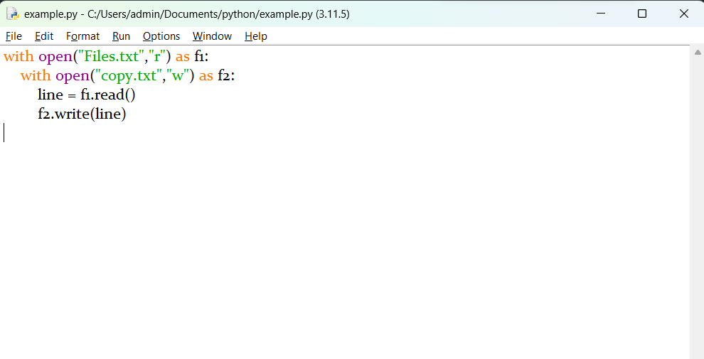
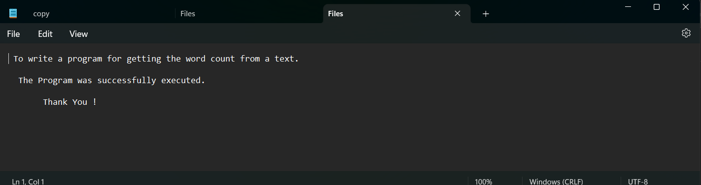
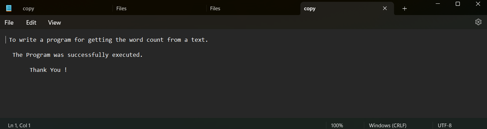

# copy-file
## AIM:
To write a python program for copying the contents from one file to another file.
## EQUIPEMENT'S REQUIRED: 
PC
Anaconda - Python 3.7
## ALGORITHM: 
### Step 1:
use open function to open the file in which we want to copy from and access it in read mode
### Step 2: 
 read the file and store it in a variable
### Step 3: 
now create a file in which we want topaste the content using write acces mode
### Step 4:  
use write function to copy the read file that has been stotred in the varible
### Step 5: 
the content in the original file will be copied in the new file
### Step 6: 
End the program
## PROGRAM:
```

with open("Files.txt","r") as f1:
    with open("copy.txt","w") as f2:
        line = f1.read()
        f2.write(line)
```


### OUTPUT:
PROGRAM
:

File.txt:


Copy.txt:



## RESULT:
Thus the program is written to copy the contents from one file to another file.